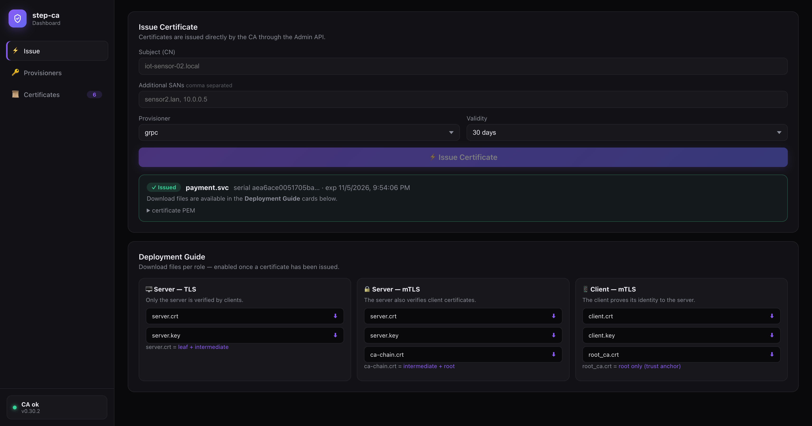

# step-ca Example

Lab lengkap belajar **Private PKI** dengan [step-ca](https://github.com/smallstep/certificates):
CA server di Docker, broker EMQX dengan mTLS, dan dashboard (Go + Svelte) untuk
menerbitkan, memperbarui, dan mengelola sertifikat & provisioner — semuanya via API murni.

```
┌─────────────────────────────┐
│  step-ca  (localhost:9000)  │  ← Certificate Authority (HTTPS API + Admin API)
│  Root → Intermediate        │
└──────────┬──────────────────┘
           │ issue cert (JWK token / X5C admin token)
           ▼
┌─────────────────────────────┐     mTLS 8883      ┌────────────────┐
│  EMQX broker (:8883)        │◄──────────────────►│  MQTT client   │
└─────────────────────────────┘                    └────────────────┘
┌─────────────────────────────┐
│  Dashboard Go + Svelte      │  issue · renew · download · kelola provisioner
│  API :8080 · UI :5173       │  (Admin API via token X5C — lihat quirks)
└─────────────────────────────┘
```

## Tampilan



## Struktur project

```
├── docker-compose.yml              # step-ca (+ init bootstrap otomatis)
├── .env / .env.example             # STEP_CA_VERSION=0.30.2 (pin versi!), CA_NAME, dst
├── data/step/                      # STEPPATH: kunci CA, certs, config, DB (JANGAN di-commit)
├── scripts/                        # helper kecil
├── mqtt/                           # EMQX + mTLS (lihat mqtt/README.md)
│   ├── docker-compose.yml
│   ├── emqx.conf
│   └── certs/
├── dashboard/
│   ├── README.md                   # dokumentasi dashboard
│   ├── server/                     # backend Go
│   │   ├── main.go                 # entry point: wiring + serve
│   │   └── internal/
│   │       ├── config/             # konfigurasi dari env
│   │       ├── types/              # struct bersama
│   │       ├── keys/               # JWK, CSR, thumbprint
│   │       ├── ca/                 # klien step-ca (OTT, /sign, /renew)
│   │       ├── store/              # persistensi sertifikat terbit
│   │       ├── admin/              # service Admin API (X5C)
│   │       ├── handlers/           # HTTP handlers
│   │       └── issued/             # cert+key tersimpan (runtime, untuk Renew)
│   └── ui/                         # Svelte 5 + Vite (dark mode)
└── step-ca.postman_collection.json
```

---

## 1. Setup server step-ca

### Jalankan

```bash
docker compose up -d
```

Saat pertama kali dijalankan, container `step-ca-init` otomatis:

1. Generate password CA → `data/step/secrets/password`
2. `step ca init --remote-management` — membuat Root CA + Intermediate CA +
   provisioner JWK `admin` + mengaktifkan **Admin API** + membuat **super admin**
   (subject default: `step`)

> ⚠️ Bootstrap super admin hanya bisa terjadi saat init fresh. Container
> `step-ca-init` idempotent: kalau `data/step/` sudah ada isinya, dia skip.

### Verifikasi

```bash
curl -sk https://localhost:9000/health          # → {"status":"ok"}
curl -sk https://localhost:9000/provisioners    # daftar provisioner
```

### File penting di `data/step/`

| File | Fungsi |
|---|---|
| `certs/root_ca.crt` | Root CA — **bagikan ke semua client** (trust anchor) |
| `certs/intermediate_ca.crt` | Intermediate — penandatangan harian |
| `secrets/password` | Password kunci CA & provisioner — **RAHASIA** |
| `config/ca.json` | Konfigurasi CA |
| `db/` | Database (provisioners, admins, ACME state) |

### Pin versi

`.env` memakai `STEP_CA_VERSION=0.30.2` — jangan `latest`, agar binary tidak
berubah diam-diam.

---

## 2. Menerbitkan sertifikat

### Cara Dashboard

```bash
cd dashboard/server && make run    # API :8080 (atau: go run .)
cd dashboard/ui && npm run dev     # UI  :5173
```

Isi form subject / SANs / provisioner / durasi → **⚡ Issue Certificate** →
download file per peran di kartu **Deployment Guide** (Server TLS, Server mTLS,
Client mTLS). Riwayat + tombol **⟳ Renew** ada di tab **Certificates**.

> Alternatif tanpa dashboard: CLI langsung di container
> (`docker exec step-ca step ca certificate ... --provisioner admin ...`) —
> berguna saat dashboard sedang tidak berjalan.
> Detail lengkap: [mqtt/README.md](mqtt/README.md) bagian "Cara Alternatif — Issue via HTTP API".

---

## 3. Mengelola provisioner

Provisioner = "pintu masuk" CA beserta policy-nya (siapa boleh minta cert,
durasi maksimum, dll). Pemegang private key provisioner-lah yang boleh minta cert.

### Cara Dashboard (Admin API murni)

Tab **Provisioners** → isi nama + durasi → **+ Add**. Dashboard otomatis:

1. Generate keypair provisioner baru
2. Kirim public JWK ke CA via Admin API (X5C)
3. Simpan private key-nya ke `dashboard/server/provisioner-<nama>.jwk.json`
   → langsung bisa dipakai issue, dan persisten antar restart

Tombol **Hapus** menghapus provisioner dari CA sekaligus file kunci lokalnya.

> Policy durasi enforcement-nya terjadi di CA: request melebihi claim → ditolak
> 403, apa pun client-nya. Default provisioner baru dari `step ca init` = 24 jam.

### Import provisioner buatan CLI ke dashboard

Provisioner yang dibuat lewat CLI tidak otomatis dikenal dashboard (dashboard
butuh private key-nya untuk sign OTT). Export & dekripsi:

```bash
docker exec step-ca step ca provisioner list \
  --ca-url https://localhost:9000 --root /home/step/certs/root_ca.crt > /tmp/prov.json
python3 -c "
import json
for p in json.load(open('/tmp/prov.json')):
    if p['name'] == '<nama>':
        open('/tmp/enc.jwe','w').write(p['encryptedKey'])"

docker cp /tmp/enc.jwe step-ca:/tmp/enc.jwe
docker exec step-ca sh -c 'step crypto jwe decrypt --password-file /home/step/secrets/password < /tmp/enc.jwe' \
  > dashboard/server/provisioner-<nama>.jwk.json
chmod 600 dashboard/server/provisioner-<nama>.jwk.json
# restart dashboard → provisioner otomatis termuat (glob provisioner-*.jwk.json)
```

> Provisioner yang dibuat **dari dashboard UI** tidak perlu langkah ini —
> private key-nya sudah otomatis disimpan & dimuat.

---

## 4. Renew

Renew step-ca memakai **cert+key lama sebagai kredensial mTLS** (`POST /renew`) —
private key tidak berubah. step-ca mengizinkan renew kapan pun selama cert masih valid.

- **Dashboard**: tab **Certificates** → tombol **⟳ Renew** per baris.
  Cert+key otomatis tersimpan di `dashboard/server/issued/` saat issue.
- **CLI**: `docker exec step-ca step ca renew --cert /tmp/x.crt --key /tmp/x.key ...`

---

## 5. Quirk yang perlu diketahui (v0.30.2)

1. **Admin API: header Authorization TANPA "Bearer "**. Middleware auth tidak
   melakukan strip pada prefix `Bearer ` — go-jose malah mendekode
   `"BearereyJ..."` sebagai base64 → error parse misterius
   (`invalid character \x05` / `illegal base64 data`). Dashboard sudah mengakali
   ini. Detail: deskripsi folder Admin API di `step-ca.postman_collection.json`
   + [smallstep/cli#860](https://github.com/smallstep/cli/issues/860).
2. **Perintah `step ca admin/provisioner` dari CLI container berjalan offline**
   (menulis DB langsung, bukan lewat HTTP) — makanya selalu berhasil.
3. **Super admin default bernama `step`** (bukan `admin`) — sumber:
   `pki.go` di repo smallstep/certificates.

---

## 6. Topik lanjutan

| Topik | Dokumen |
|---|---|
| EMQX + mTLS end-to-end | [mqtt/README.md](mqtt/README.md) |
| Dashboard (Go + Svelte), arsitektur `internal/` | [dashboard/README.md](dashboard/README.md) |
| Koleksi API (Postman) | `step-ca.postman_collection.json` |
| Konsep PKI, X5C, chain | deskripsi folder Admin API di koleksi Postman |

## 7. Catatan produksi

- Sertifikat pendek + auto-renew > sertifikat umur panjang + revoke manual
- Root CA key harus offline; yang online hanya intermediate
- `data/step/` = seluruh isi kepercayaan PKI — backup & jaga aksesnya
- Belum ada HTTPS di depan dashboard Go; tambahkan reverse proxy + auth sebelum expose
- Key sertifikat tersimpan di `dashboard/server/issued/` untuk fitur Renew —
  untuk produksi, lebih baik device menyimpan key-nya sendiri dan renew mandiri
